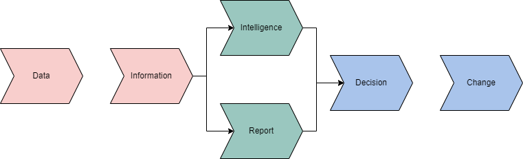
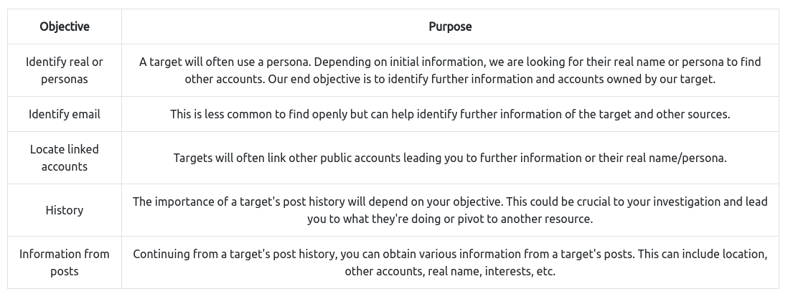

# Ransomware Madness


## OSINT and the Digital Footprint
- OSINT - open source intelligence that comes from digital footprints
- Information is found in two places
    - Clearnet - anything you can publicly access with traditional web browser
    - Darknet - accessed using special software
        - Used by privacy-minded people, whistleblowers, censored people, criminals, journalists, and government
            - TOR
            - Freenet
            - I2P
            - IPFS
            - Zeronet

## OSINT Process Cycle
- Different types of RIS OSINT models
    - Data-information model - Intelligence comes from information, which comes from data
        - 
    - Roller coaster - Revolves around client
        - 

## Account Discovery and Analysis
- Accounts are a well known digital foorprint
- 

## OSINT and the Blockchain
- Blockchain is built around being open and anonymous
- Some tools for exploring the blockchain
    - Blocktrail
    - Bitcoin Who's Who
    - Graphsense
    - Block Explorer

## Going Deeper
- Each platform will have its unique functionality that can be used, familiarize yourself with these platforms
- Ex. Someone forgot to delete API keys on their file, so they make a new commit to erase them. But they will still show in their commit history

## Exercise
```
!!! ВАЖНЫЙ !!!

Ваши файлы были зашифрованы Гринчем. Мы используем самые современные технологии шифрования.

Чтобы получить доступ к своим файлам, обратитесь к оператору Grinch Enterprises.

Ваш личный идентификационный идентификатор: «b288b97e-665d-4105-a3b2-666da90db14b».

С оператором, назначенным для вашего дела, можно связаться как "GrinchWho31" на всех платформах.

!!! ВАЖНЫЙ !!!
```

1. Use google translate to translate it. GrinchWho31
```
!!! IMPORTANT!!! Your files were encrypted by the Grinch. We use state-of-the-art encryption technology. To access your files, contact Grinch Enterprises. Your personal identification ID is "b288b97e-665d-4105-a3b2-666da90db14b". The operator assigned to your case can be contacted as "GrinchWho31" on all platforms. !!! IMPORTANT!!!
```
2. Google GrinchWho31 and we find it on twitter
3. The pinned tweet has `1GW8QR7CWW3cpvVPGMCF5tZz4j96ncEgrVaR`
4. Keybase.io
5. Follow the link on the tweet `https://keybase.io/grinchwho31/sigs/1GW8QR7CWW3cpvVPGMCF5tZz4j96ncEgrVaR` and we find that the btc address is `bc1q5q2w2x6yka5gchr89988p2c8w8nquem6tndw2f`
6. We see the Grinch's github account on the page `https://github.com/ChristmasHater31`. We look at the Christmas-Stealer repository and see that the address is in ransom.cpp
7. Go to the ChristBASHTree repository and look through the history. In the "Create tree.sh" commit we see that the contact info is at the end of the file. "DonteHeath21@gmail.com"
8. Donte Heath
