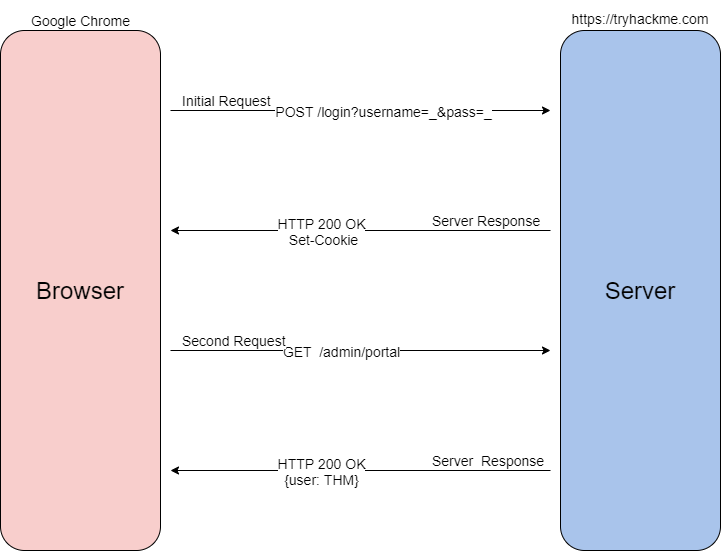

# Elf HR Problems

## Cookies
- HTTP is a stateless protocol, so cookies are needed to manage a stateful session between client and server
- Cookies can be assigned any name and value according to webserver
- Authentication/session cookies are used to identify you and what access level is attached to your session
- 
- Cookie process
    1. When you send a POST request, the web server will verify that it received the data and set a unique cookie
    2. Once the cookie is set, all future GET requests will be automatically sent with the cookie, as long as the cookie stays stored in your browser
    3. Once the server receives the GET request and the cookie, it will deserialize your session
### Cookie Components
- 11 different components
