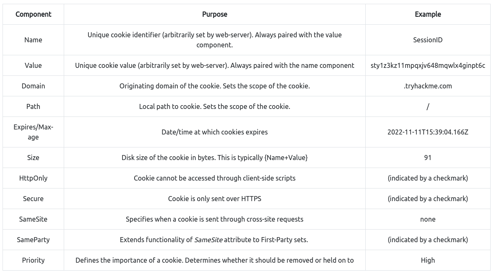

# Elf HR Problems

## Cookies
- HTTP is a stateless protocol, so cookies are needed to manage a stateful session between client and server
- Cookies can be assigned any name and value according to webserver
- Authentication/session cookies are used to identify you and what access level is attached to your session
- 
- Cookie process
    1. When you send a POST request, the web server will verify that it received the data and set a unique cookie
    2. Once the cookie is set, all future GET requests will be automatically sent with the cookie, as long as the cookie stays stored in your browser
    3. Once the server receives the GET request and the cookie, it will deserialize your session
### Cookie Components
- 11 different components
- 
- As attackers, we only need to consider Name and Value; the others are handled by the webserver
- Cookie components are prepared in pairs
    - name-value is the name of the cookie and the value of the name
    - attribute-value defines an attribute of the cookie and the value of the attribute
        - Set cookie syntax: `Set-Cookie: <cookie-name>=<cookie-value>; Domain=<domain-value>; Secure; HttpOnly`
### Cookie Manipulation
- Cookie Manipulation - Taking a cookie and modifying it to obtain unintended behavior determined by the web dev
- Possible because cookies are stored locally on your pc, so you have complete control to modify
- To view cookies go to Inspect Element > Application > Storage > Cookies
- Cookie Manipulation Summary
1. Obtain a cookie value from registering or signing up for an account.
2. Decode the cookie value.
3. Identify the object notation or structure of the cookie.
4. Change the parameters inside the object to a different parameter with a higher privilege level, such as admin or administrator.
5. Re-encode the cookie and insert the cookie into the value space; this can be done by double-clicking the value box.
6. Action the cookie; this can be done by refreshing the page or logging in.

## Exercise
1. Go to the website, sign up, and we encounter this error `Uh Oh! You don't have permission to register an account currently. Please contact an administrator for more assistance.`
2. Inspect element > Application > Storage > Cookies, and there should be a cookie. The name of the cookie is "user-auth"
3. Copy the value of "user-auth" - `7b636f6d70616e793a2022546865204265737420466573746976616c20436f6d70616e79222c206973726567697374657265643a2254727565222c20757365726e616d653a22626f62227d` - and try decoding it on cyberchef with the most common encoding methods: base64 and hexadecimal. It turns out to be hexadecimal and we get `{company: "The Best Festival Company", isregistered:"True", username:"bob"}`
4. Now change the value of "username" to "admin" and encode it again, and we get `7b636f6d70616e793a2022546865204265737420466573746976616c20436f6d70616e79222c206973726567697374657265643a2254727565222c20757365726e616d653a2261646d696e227d`
5. Go back to the cookie section in inspect element and replace the old cookie with the one we encoded, then reload the page. We see three teams: Finance, HR, and Application, and the status for HR is red.
6. The Application team status is yellow and has a paused symbol
