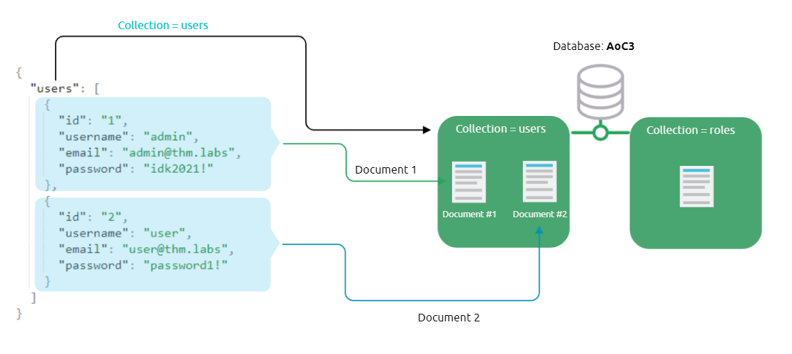

# Migration Without Security

## What is NoSQL
- NoSQL database refers to a non-relational database that stands for `non SQL` and `not only SQL`
- NoSQL databases are used for big data and IoT devices due to their fast queries, ease of use, scalability, and flexible data structure

## Understanding NoSQL
- MongoDB is a popular document-store NoSQL database
- MongoDB also has relational databases, tables, and fields but with different names
    - Collections are similar to tables and views in MySQL
    - Documents are similar to rows or records in MySQL
    - Fields are similar to columns
    - 
- MongoDB query operators
    - $and equivalent to AND in MySQL
    - $or is OR in MySQl
    - $eq is = in MySQL
- Basic MongoDB commands
    - `mongo` to enter mongo shell
    - `show databases` to show all databases
    - `use <database name>` to open database if exists or create if it doesn't
    - `db.createCollection(<collection name>)` to create new collection
    - `db.<collection name>.insert({json data})` to insert a document
    - `db.<collection name>.find()` to see all documents inside collection
    - `db.<collection name>.findOne()` another way of finding stuff
    - `db.<collection name>.update(<id>, <data>)` to update document
    - `db.<collection name>.remove(<id>)` to remove document with id
    - `db.<collection name>.drop()` to delete the collection

## What is NoSQL Injection?
- NoSQL injection is a web security vulnerability that allows the attacker to have control over the database
- A NoSQL injection happens by sending queries via untrusted and unfiltered web application input, which leads to leaked unauthorized information
- NoSQL injection can be used to modify data, escalate privileges, DoS attacks, etc.

- MongoDB [operators](https://docs.mongodb.com/manual/reference/operator/query/) that are used in injections
    - $eq - matches records that equal to a certain value
    - $ne - matches records that are not equal to a certain value
    - $gt - matches records that are greater than a certain value.
    - $where - matches records based on Javascript condition
    - $exists - matches records that have a certain field
    - $regex - matches records that satisfy certain regular expressions.
