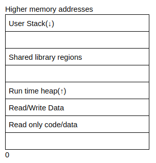
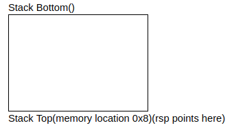
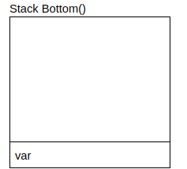
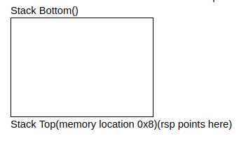
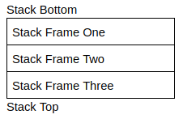
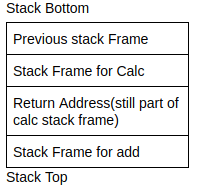
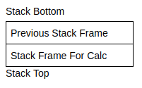
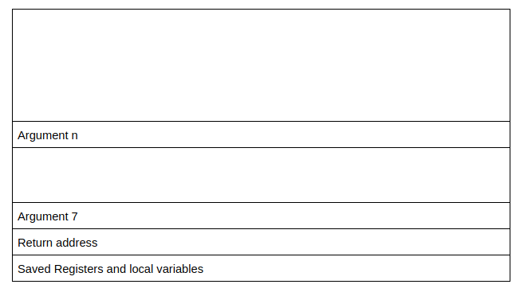

# Buffer Overflows

- Read my `Intro to x86-64` notes before this

## Process Layout
- When a program is run, the computer runs it as a process
- Current computer architecture allows processes to be run concurrently
- While processes may seem to run at the same time, the computer actually switches between the processes very quickly
    - Switching between processes is called a context switch
- Since each process may need different information to run, the OS has to keep track of all the information in a process, which is organized sequentially
- 
    - User stack - contains information required to run the program
        - Current program counter, saved registers, etc.
            - Section after user stack is unused memory and used in case the stack grows downwards
    - Shared library regions - used to statically/dynamically link libraries that are used by the program
    - Heap - increases and decreases depending on whether a program dynamically assigns memory
        - The section above the heap is used in case the size of the heap increases
    - Program code and data stores the program executable and initialized variables
- Exercise
    1. The dynamically allocated memory is stored in the heap
    2. The information about functions (Ex. local arguments) are stored in the stack

## Must Watch
- [Great must watch resource about stacks and heaps](https://www.youtube.com/watch?v=_8-ht2AKyH4)

## x86-64 Procedures
- 
    - Stack - a region of contiguous memory addresses that is used to easily transfer control and data between functions
        - The top of the stack is at the lowest memory address and the stack grows towards lower memory addresses
    - Most common operations of stack
        - Push - add data to the top of the stack
        - Pop - remove data from the top of the stack
- 
    - `push var` - Assembly instruction to push a value onto the stack
    - Steps taken by `push`
    1. Uses `var` or the value stored in the memory location of var
    2. Decrements the stack pointer - known as `rsp` - by 8
    - 
    3. Writes the value and then changes the location of `rsp` to the top of the stack
- 
    - `pop var` - assembly instruction to read a value and pop it off the stack
    - Steps taken by `pop`
    1. Reads the value at the address given by the stack pointer
    2. Increments the stack pointer by 8
    - 
    3. Stores the value that was read from `rsp` into var
    - Note: The memory does not change when popping values of the stack, only the value of the stack pointer changes
- Each compiled program may include multiple functions, where each function would need to store local variables, arguments, etc. passed to the function
    - To make this managable, each function has its own stack frame, with a new stack frame allocated when a function is called, and deallocated when the function is complete
    - 
- Ex.
```
int add(int a, int b){

   int new = a + b;

   return new;

}

int calc(int a, int b){

   int final = add(a, b);

   return final;

}

calc(4, 5)
```
- Exercise
    1. The stack is grown towards the lower memory addresses
    2. The `push` instruction is used to add data onto the stack

## Procedures Continued
- 
    - The calc function is the caller and the add function is the callee
- 
    - The add function is invoked using `call` in assembly
        - `call` can take either a label as an argument (a function name) or the memory address of the start of the function
    - After the function is called, the address of the next instruction is pushed onto the stack
    - Then the program allocates a stack frame for the new function, change the current instruction pointer (rip) to the first instruction in the function, change the stack pointer (rsp) to the top of the stack, and change the frame pointer (rbp) to point to the start of the new frame
- 
- 
    - Once the function is finished executing, it will call the return instruction `retq`
    - `retq` will pop the value of the return address off the stack, deallocate the stack frame for the add function, change the instruction pointer to the value of the return address, change the stack pointer to the top of the stack, and change the frame pointer to the stack frame of calc
- 
- 
- Data is transferred to functions through arguments
    - Arguments can be stored in these registers
        - rdi
        - rsi
        - rdx
        - rcx
        - r8
        - r9
    - If the function has any more arguments, they can be stored in the function's stack frame
    - rax is a special register that stores the return values of the functions
    - The caller function may save values in the registers, but the calle function may also need to do so
        - To ensure values aren't overwritten, the callee function saves the values of the registers on its own stack frame, uses the registers, and then loads the values back into the registers
        - The caller function can also save values on its own function frame to prevent values from being overwritten
    - A few registers are saved by specifically the caller or callee
```
rax is caller saved
rdi, rsi, rdx, rcx r8 and r9 are called saved(and they are usually arguments for functions)
r10, r11 are caller saved
rbx, r12, r13, r14 are callee saved 
rbp is also callee saved(and can be optionally used as a frame pointer)
rsp is callee saved
```
- 

## Endianess
- Endianess - Different architectures represent the same hex number in different ways
- Ex. `0x12345678`
- Little endian is when the value is arranged from the least significant byte to the most significant byte
    - 
- Big endian is where the value is arranged from the most significant byte to the least significant byte
    - 

## Overwriting Variables
- 
