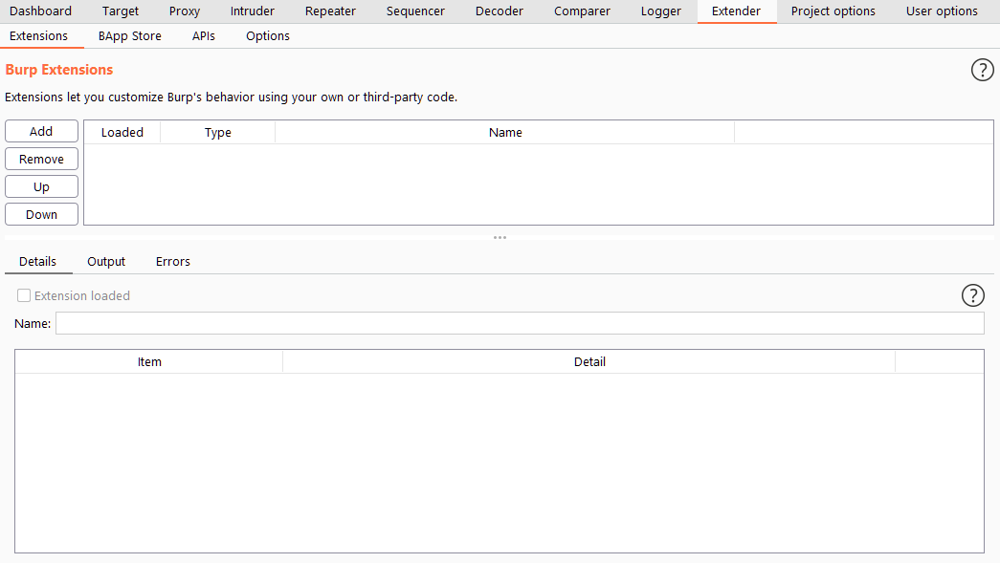

# Burp Suite: Extender

## The Extender Interface
- The default view in the Extender interface gives us an overview of the extensions that we have loaded into Burp Suite

- The options to the left of this box allow us to uninstall extensions with the Remove button or install new ones from files on our disk with the Add button. These could be either modules that we have coded or modules that have been made available on the internet but are not in the BApp store. The Up and Down buttons in this section control the order that installed extensions are listed in. Extensions are invoked in descending order based on this list. In other words: all traffic passing through Burp Suite will be passed through each extension in order, starting at the top of the list and working down. This can be very important when dealing with extensions that modify the requests as some may counteract or otherwise hinder one another.

## The BApp Store
- The Burp App Store (or BApp Store for short) gives us a way to easily list official extensions and integrate them seamlessly with Burp Suite. Extensions can be written in a variety of languages -- most commonly Java (which integrates into the framework automatically) or Python (which requires the Jython interpreter -- more on this in the next task!).
- Different extensions have different behaviours: some merely add a new item to right-click context menus; others create entirely new tabs in the main menu bar

## Jython
- If we want to use Python modules in Burp Suite, we need to have downloaded and included the separate Jython Interpreter JAR file. The Jython interpreter is a Java implementation of Python. The website gives us the option to either install Jython to our system or download it as a standalone Java archive (JAR). We need it as a standalone archive to integrate it with Burp
- To install Jython on Burp
	1. Download the Jython JAR archive
	2. Set the location of the JAR file in Options > Python Environment
