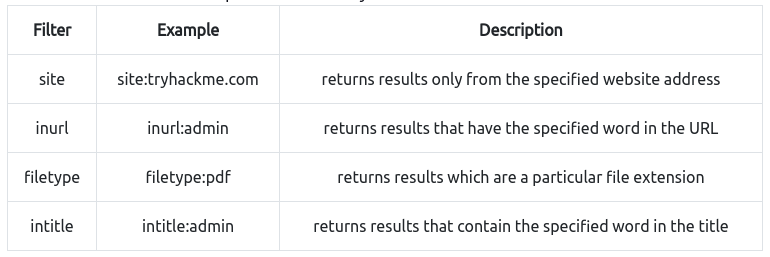

# Content Discovery

## What is Content Discovery?
- In cybersecurity, we're looking for content such as:
    - pages and portals meant for staff usage
    - older versions of the website
    - backup files
    - configuration files
    - admin panels
- Three main ways of discovering content on a website:
    - Manual
    - Automated
    - OSINT (open source intelligence)
## Manual Discovery - Robots.txt
- The robots.txt file is a document that tells search engines which pages they are and aren't allowed to show on their search engine results, or ban specific search engines altogether
- It's common to restrict areas of a website so that they aren't displayed in search engine results, such as admin portals or files meant for the website's customers
- This file gives a lot of locations that the website owners don't want us to discover
- Exercise
    - Go to the `machine_ip/robots.txt` and we find that `/staff-portal` is not allowed to be viewed by web crawlers
>    User-agent: *
>    Allow: /
>    Disallow: /staff-portal
## Manual Discovery - Favicon
- The favicon is a small icon displayed in the browser's address bar or tab
- When frameworks are used to build a website, sometimes a favicon is left over if the developer doesn't replace it with a custom one, and this can give us a clue as to which framework was used
- OWASP has a [database](https://wiki.owasp.org/index.php/OWASP_favicon_database) of hashed icons, which can be compared with the website you're targeting
- Ex. If want to check an icon is from a framework, simply download it, find the hash, and compare it with the database: `curl https://static-labs.tryhackme.cloud/sites/favicon/images/favicon.ico | md5sum`
- Exercise
    - Use the above shell command, compare it witht he oswap database and we find that the favicon belongs to the cgiirc framework
## Manual Discovery - Sitemap.xml
- The sitemap.xml file gives a list of every file the search engine can crawl
- These can contain areas of the website that are more difficult to navigate or list some old pages that the site no longer uses but still exist
- Exercise
    - Use `curl machine_ip/sitemap.xml` and we find `/s3cr3t-area`
><?xml version="1.0" encoding="UTF-8"?>
><urlset xmlns:xsi="http://www.w3.org/2001/XMLSchema-instance">
>    <url>
>        <loc>http://10.10.240.54/</loc>
>        <lastmod>2021-07-19T13:07:32+00:00</lastmod>
>        <priority>1.00</priority>
>    </url>
>    <url>
>        <loc>http://10.10.240.54/news</loc>
>        <lastmod>2021-07-19T13:07:32+00:00</lastmod>
>        <priority>0.80</priority>
>    </url>
>    <url>
>        <loc>http://10.10.240.54/news/article?id=1</loc>
>        <lastmod>2021-07-19T13:07:32+00:00</lastmod>
>        <priority>0.80</priority>
>    </url>
>    <url>
>        <loc>http://10.10.240.54/news/article?id=2</loc>
>        <lastmod>2021-07-19T13:07:32+00:00</lastmod>
>        <priority>0.80</priority>
>    </url>
>    <url>
>        <loc>http://10.10.240.54/news/article?id=3</loc>
>        <lastmod>2021-07-19T13:07:32+00:00</lastmod>
>        <priority>0.80</priority>
>    </url>
>    <url>
>        <loc>http://10.10.240.54/contact</loc>
>        <lastmod>2021-07-19T13:07:32+00:00</lastmod>
>        <priority>0.80</priority>
>    </url>
>    <url>
>        <loc>http://10.10.240.54/customers/login</loc>
>        <lastmod>2021-07-19T13:07:32+00:00</lastmod>
>        <priority>0.80</priority>
>    </url>
>    <url>
>        <loc>http://10.10.240.54/s3cr3t-area</loc>
>        <lastmod>2021-07-19T13:07:32+00:00</lastmod>
>        <priority>0.80</priority>
>    </url>
## HTTP Headers
- When we make a request, the server returns HTTP headers that can contain useful information
- Use curl to make the request, and use the -v option for verbosity
- Exercise
    - Use `curl -v machine_ip` and we find that the X-FLAG is `THM{HEADER_FLAG}`
> TCP_NODELAY set
> Connected to 10.10.240.54 (10.10.240.54) port 80 (#0)
> GET / HTTP/1.1
> Host: 10.10.240.54
> User-Agent: curl/7.58.0
> Accept: */*
> 
> HTTP/1.1 200 OK
> Server: nginx/1.18.0 (Ubuntu)
> Date: Tue, 07 Dec 2021 00:25:49 GMT
> Content-Type: text/html; charset=UTF-8
> Transfer-Encoding: chunked
> Connection: keep-alive
> X-FLAG: THM{HEADER_FLAG}
## Manual Discovery - Framework Stack
- Once you've determined the framework used to create the website, locate the framework's website and learn more about it
- Exercise
    - On the page source of the website, we find that thm web framework was used `Page Generated in 0.03900 Seconds using the THM Framework v1.2 ( https://static-labs.tryhackme.cloud/sites/thm-web-framework )`
    - After going to the website and viewing the documentation, we see that there's an administration portal at `/thm-framework-login`, and the default username and password are `admin`
    - After logging in we find the flag is `THM{CHANGE_DEFAULT_CREDENTIALS}`
## OSINT - Google Hacking/Dorking
- Google dorking allows you to pick out custom content from google search, such as specific domain names
- 
- [Wikipedia](https://en.wikipedia.org/wiki/Google_hacking)
## OSINT - Wappalyzer
- [Wappalyzer](https://www.wappalyzer.com/) is an online tool and browser extension that helps identify what technologies a website uses, such as frameworks, Content Management Systems (CMS), payment processors, version numbers, etc.
## OSINT - Wayback Machine
- [Wayback Machine](https://archive.org/web/) is a historical archive of websites that can help uncover old pages that may still be active on the current website
## OSINT - Github
- Companies may use github to store their code repositories, and if they're public you'll have access to all of their code
## OSINT - S3 Buckets
- A storage service provided by AWS, allowing people to save files and static website content in the cloud
- Owners can set access permissions, but sometimes these permissions are set incorrectly and allow access to files that shouldn't be available to the public
- Format is `http(s)://{name}.s3.amazonaws.com`
## Automated Discovery
- Process of using tools to discover content rather than doing it manually
- Usually contains hundreds, thousands, or millions of requests to a web server
- A few popular automation tools are fuff, gobuster, and dirb
- Exercise
    - Use gobuster `gobuster dir --url http://10.10.95.47/ -w /usr/share/wordlists/SecLists/Discovery/Web-Content/common.txt` to find /monthly and development.log
