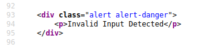
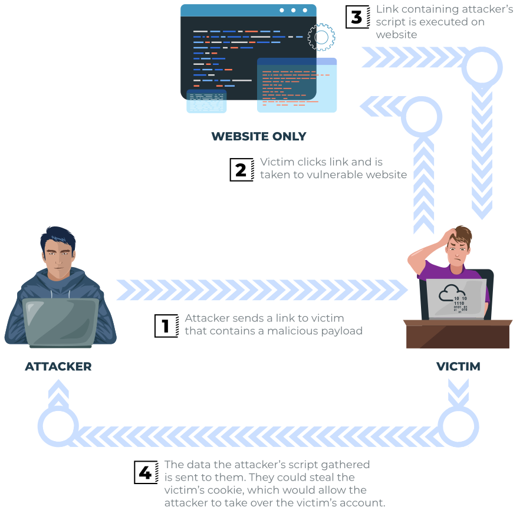
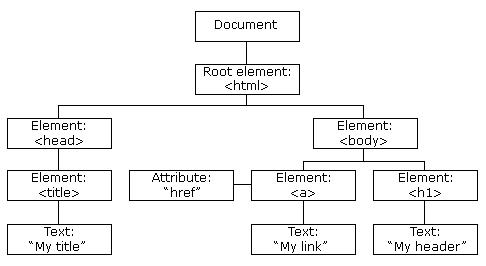

# Cross-Site Scripting (XSS)

- XSS is based on js
- XSS is an injection attack where js gets injected into a web application with the intention of being executed by other users

## XSS Payloads
- The payload is the js code we want to be executed on the target's computer
- 2 parts:
    - Intention - what you want the js to do
    - Modification - the changes we need to make to make it execute in different situations
- Proof of concept
    - One of the simplest payloads to demonstrate that you can achieve XSS on a website: ``
- Session Stealing
    - Details of a user's session are kept in cookies
    - This js takes the target's cookie, encodes it in base64, and posts it to a hacker's website: ``
- Key Logger
    - Keylogger - anything typed on the webpage will be forwarded to a website under the hacker's control: ``
- Business Logic
    - Much more specific that other payloads
    - This calls on a particular network resource or js function
    - Ex. Change a user's email address: ``
- Exercise
    - document.cookie
    - alert

## Reflected XSS
- Reflected XSS occurs when user-supplied data in an HTTP request is included in the webpage source without any validation
- Ex.
    - When incorrect input is entered, an error message is displayed. The content of the error message is taken from the error parameter and added directly to the page source
        - 
    - The input of the error parameter isn't sanitized, which allows the attacker to insert malicious code
        - 
    - The vulnerability can be used
        - 
- Potential impact
    - Attacker could send links or embed them into a website containing a js payload to victims and reveal sensitive information
- How to test for reflected xss
    - Parameters in the URL query string
    - URL file path
    - HTTP Headers
- Once you've found data that is being reflected in the web application, confirm that you can successfully run your js payload; your payload will be dependent on where in the application your code is reflected
- Exercise
    - parameters

## Stored XSS
- XSS payload stored on the web application (like in a database) that gets run when other users visit the site or web page
- Ex.
    - A blog allows users to post comments, but they're not checked to see if they contain js or filter out malicious code. If a user posts a comment containing js, the code will be stored in the database, and every user visiting the article will have the js run on their browser
    - 
- Potential impact
    - The malicious js could redirect users to another site, steak the user's cookie, or perform other web actions while acting as the visiting user
- How to test for stored xss
    - Test every possible point of entry where it seems data is stored and then shown back in areas that other users have access to
        - Comments on a blog
        - User profile information
        - Website listings
- Sometimes devs think limiting input values on the client side is good enough protection, so changing values to something the web application wouldn't be expecting is a good source of discovering stored XSS
    - Ex. An age field that is expecting an integer from a dropdown menu, but instead you manually send the request rather than using the form allowing you to try malicious payloads
- Once you've found data that is being reflected in the web application, confirm that you can successfully run your js payload; your payload will be dependent on where in the application your code is reflected
- Exercise
    - database

## DOM Based XSS
- DOM - document object model, a programming interface for html and xml documents
- 
- Exploiting the DOM1
    - DOM based xss is where the js execution happens directly in the browser without any new pages being loaded or data submitted to the backend code
    - Execution occurs when the website js code acts on input or user interaction
- Potential impact
    - Crafed links could be sent to victims, redirecting them to another website or steal content from the page or the user's session
- How to test for DOM based XSS
    - DOM based XSS can be challenging to test for and request a certain knowledge of js to read the source code
    - Look for parts of the code that access certain variables that an attacker can have control over, such as "window.location.x" parameters
- When you've found those bits of code, you'd then need to see how they are handled and whether the values are ever written to the web page's DOM or passed to unsafe JavaScript methods such as eval()
- Exercise
    - eval()

## Blind XSS
- Similar to stored XSS in that payload gets stored on the website for another user to view, but you can't see the payload working or be able to test it against yourself first
- Ex.
    - Aa website has a contact form where you can message a member of staff
    - The message content doesn't get checked for malicious code, which allows the attacker to enter anything they wish
    - These messages then get turned into support tickets which staff view on a private web portal
- Potential impact
    - Using the correct payload, the attacker's js could make calls back to an attacker's website, revealing the staff portal URL, the staff member's cookies, and the contents of the portal page that is being viewed
    - Now the attacker could hijack the staff member's session and have access to the private portal
- How to test for Blind XSS
    - When testing for blind XSS, ensure that your payload has a call back (usually an HTTP request). This way you know if and when your code is being executed
    - A popular tool for blind XSS attacks is [xsshunter](https://xsshunter.com/)
        - Automatically captures cookies, URLs, page contents, etc.
- Exercise
    - xsshunter
    - stored xss

## Perfecting Your Payload
- These are all reflected XSS examples
- Level 1
    - ``
- Level 2
    - The name is being reflected into another input tag: `<h2>Hello, <input value=""></h2>`
    - We can escapt the value attribute by prepending `">` to close the input tag, then start our script: `<h2>Hello, <input value="">"></h2>`
- Level 3
    - If we try to use the same payload normally we get: `<h2>Hello, <textarea></textarea></h2>`
    - To escape it, we need to close the textarea tag before we add the script tag: `<h2>Hello, <textarea></textarea></textarea></h2>`
- Level 4
    - This time, a script tag is being used to display the text we enter:
    `
        ';
        </script>
    `
    - The nested script tags we enter mess with the script tags that manage the document.getElementsByClassName
    - To bypass this we simply add 2 nested script tags to complete the outer script tage
    `
    
    `
    - Another way to do so is by prepending `';` to close the string and then end the line, inserting the js code, `alert('THM')`, and then appending `;//` to end the line and make everything else a comment
    `
    
    `
- Level 5
    - We try `` just like all the other levels, but the "script" is removed, rendering the code useless: `<h2>Hello, <>alert('THM')</></h2>`
    - We can bypass this by tricking the program to remove the word, but complete it at the same time: Entering `<sscriptcript>alert('THM')</sscriptcript>` to get `<h2>Hello, </h2>`
- Level 6
    - We try the same strategy as Level 2 by inputting `">`, but we see that the < and > characters are filtered out: ``
    - We can use the img tag's attribute onload, which executes code when the image is loaded: `/images/cat.jpg" onload="alert('THM')`. When we input that, we get ``
- Exercise
    - THM{XSS_MASTER}

## Polyglots
- XSS polyglots are strings of text which can help escapt attributes, tags, and bypass filters
- This polyglot would have worked on all of the levels: ``jaVasCript:/*-/*`/*\`/*'/*"/**/(/* */onerror=alert('THM') )//%0D%0A%0d%0a//</stYle/</titLe/</teXtarEa/</scRipt/--!>\x3csVg/<sVg/oNloAd=alert('THM')//>\x3e``

## Practical Example (Blind XSS)
- If we create a ticket, click on the id to go into ticket information, and view the page contents, we see that the main contents of the ticket is being displayed on a textarea
`

<label>Status:</label> Open

<label>Ticket Id:</label> 3

<label>Ticket Subject:</label> test

<label>Ticket Created:</label> 08/12/2021 19:31

<label>Ticket Contents:</label>

<textarea class="form-control">test</textarea>

`
- We can bypass this like we did in the previous section with `</textarea>`
- Now we someone opens the support ticket, we can steal their cookies by starting up a listener on a port `nc -nlvp port` and then entering this as the main contents of the ticket `</textarea>`
- The textarea tag closes the textarea field.
- The script tag opens open an area for us to write JavaScript.
- The fetch() command makes an HTTP request.
- {URL_OR_IP} is either the THM request catcher URL or your IP address from the THM AttackBox or your IP address on the THM VPN Network. 
- ?cookie= is the query string that will contain the victim's cookies. 
- btoa() command base64 encodes the victim's cookies. 
- document.cookie accesses the victim's cookies for the Acme IT Support Website. 
- script closes the JavaScript code block. 

- Exercise
    - We get the cookie `c3RhZmYtc2Vzc2lvbj00QUIzMDVFNTU5NTUxOTc2OTNGMDFENkY4RkQyRDMyMQ==`, when we decode it we get `staff-session=4AB305E55955197693F01D6F8FD2D321`
