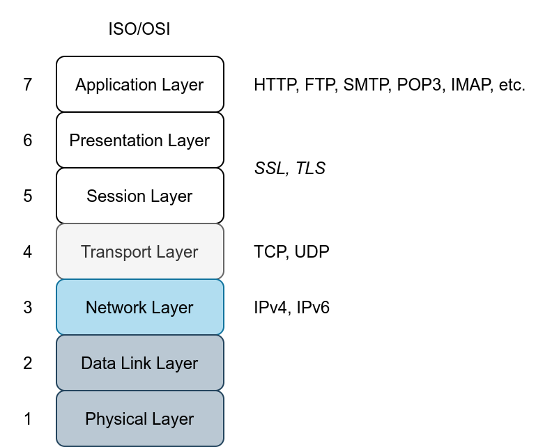

# Firewalls


- Firewall - software or hardware that monitors network traffic and compares it against a set of rules before passing or blocking it
- Most firewalls check:
    - Protocol
        - TCP
        - UDP
        - ICMP
    - Source address
    - Destination address
    - If TCP or UDP, then check source port number and destination port number
- 
- 
- Great information on protocols and ports [website](http://www.iana.org/assignments/service-names-port-numbers/service-names-port-numbers.xhtml)

## Types of Firewalls
- Different ways of classifying firewalls
1. Whether they're independent appliances
    - Hardware firewall - a separate piece of hardware that the network traffic has to go through
    - Software firewall - software that comes with the OS, or can be installed as an additional service
2. Whether they're commercial or personal
    - Personal firewall - designed to protect a single system or a small network
        - Such as a small number of devices and systems at a home network
        - Many wireless access points have built in firewalls
    - Commercial firewall - protects medium to large networks
        - Higher reliability and procession power
        - Support a higher network bandwidth
        - University or company
- From a red team perspective, the most important classification would be based on the firewall inspection abilities
    - Firewalls focus on layers 3 and 4, and more advanced ones also cover 5, 6, and 7
- 
- A few types of firewalls
```
Packet-Filtering Firewall: Packet-filtering is the most basic type of firewall. This type of firewall inspects the protocol, source and destination IP addresses, and source and destination ports in the case of TCP and UDP datagrams. It is a stateless inspection firewall.
Circuit-Level Gateway: In addition to the features offered by the packet-filtering firewalls, circuit-level gateways can provide additional capabilities, such as checking TCP three-way-handshake against the firewall rules.
Stateful Inspection Firewall: Compared to the previous types, this type of firewall gives an additional layer of protection as it keeps track of the established TCP sessions. As a result, it can detect and block any TCP packet outside an established TCP session.
Proxy Firewall: A proxy firewall is also referred to as Application Firewall (AF) and Web Application Firewall (WAF). It is designed to masquerade as the original client and requests on its behalf. This process allows the proxy firewall to inspect the contents of the packet payload instead of being limited to the packet headers. Generally speaking, this is used for web applications and does not work for all protocols.
Next-Generation Firewall (NGFW): NGFW offers the highest firewall protection. It can practically monitor all network layers, from OSI Layer 2 to OSI Layer 7. It has application awareness and control. Examples include the Juniper SRX series and Cisco Firepower.
Cloud Firewall or Firewall as a Service (FWaaS): FWaaS replaces a hardware firewall in a cloud environment. Its features might be comparable to NGFW, depending on the service provider; however, it benefits from the scalability of cloud architecture. One example is Cloudflare Magic Firewall, which is a network-level firewall. Another example is Juniper vSRX; it has the same features as an NGFW but is deployed in the cloud. It is also worth mentioning AWS WAF for web application protection and AWS Shield for DDoS protection.
```
