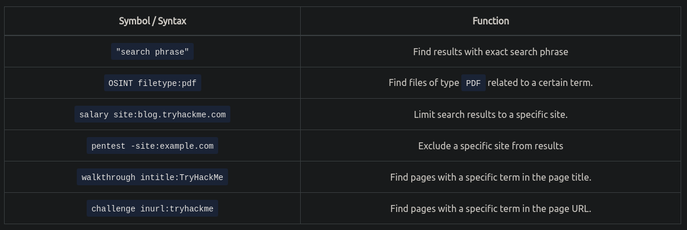

# Red Team Recon


## Introduction
- In a red team operation you start with minimal information and need to start gathering information about the target
- Reconnaissance (recon) - a preliminary observation of your target without alerting them of your activities
    - Can be passive or active

## Taxonomy of Reconnaissance
- Passive Recon
    - Can be carried out by watching passively
    - Relies on publicly available information that is collected and maintained by a third party
    - OSINT is used to collect information about the target and can be as simple as viewing a target's publicly available social media profile
    - Information we may collect
        - Domain names
        - IP address blocks
        - Email addresses
        - Employee names
        - Job posts
- Active Recon
    - Requires interacting with the target to provoke it in order to observer its response
    - Send requests and packets to observe if and how it responds
        - Ex. nmap scan
    - Has two parts
        - External recon - conducted outside that target's network and focuses on the externally facing assets from the internet
            - Ex. running nikto from outside the company network
        - Internal recon - conducted from within the company's network

## Built-in Tools
- whois
    - whois uses the WHOIS protocol
    - WHOIS - a request and response protocol
        - WHOIS server listens on TCP port 43 for incoming requests
        - Domain registrar is responsible for maintaining the WHOIS records for the domain name it's leasing
    - whois queries the WHOIS server to provide all saved records
    - whois can provide
```
Registrar WHOIS server
Registrar URL
Record creation date
Record update date
Registrant contact info and address (unless withheld for privacy)
Admin contact info and address (unless withheld for privacy)
Tech contact info and address (unless withheld for privacy)
```

- nslookup
    - Uses the default DNS server to get the A and AAAA records for the domain
- dig (domain information groper)
    - Provides query options and allows you to specify a different DNS server
- host
    - Alternative for querying DNS servers for DNS records
- traceroute
    - Traces the route taken by the packets from our system to the target host
    - Some routers don't respond to the packets sent by traceroute, and `*` is used to indicate it
- Exercise
    1. Use `whois thmredteam.com` to get `2021-09-24`
    2. Use `nslookup clinic.thmredteam.com` to get 2 ipv4 and 2 ipv6

## Advanced Searching
- 
- Different search engines have different search syntax
    - [Google](https://www.google.com/advanced_search)
    - [Google](https://support.google.com/websearch/answer/2466433)
    - [DuckDuckGo](https://help.duckduckgo.com/duckduckgo-help-pages/results/syntax/)
    - [Bing](https://help.bing.microsoft.com/apex/index/18/en-US/10002)
- Search engines crawl for information, and this can lead to indexing confidential information
```
Documents for internal company use
Confidential spreadsheets with usernames, email addresses, and even passwords
Files containing usernames
Sensitive directories
Service version number (some of which might be vulnerable and unpatched)
Error messages
```
- [Google Hacking Database](https://www.exploit-db.com/google-hacking-database) collects advanced google searches with specific terms
    - Categories
        - Footholds
        - Files Containing Usernames
        - Sensitive Directories
        - Web Server Detection
        - Vulnerable Files
        - Vulnerable Servers
        - Error Messages
- Social Media
    - Social media platforms can reveal a lot of information about the target
    - LinkedIn
    - Twitter
    - Facebook
    - Instagram
    - You may learn specific pieces of information that can reveal answers to password recovery options or gain ideas to include in a targeted wordlist
- Job Ads can reveal information about company's infrastructure
    - Use wayback machine to get previous job openings
- Exercise
    1. `filetype:xls site:clinic.thmredteam.com`
    2. `"passwords" site:clinic.thmredteam.com`

## Specialized Search Engines
- There are third party services that offer paid services for historical WHOIS data
    - Useful if the domain registrant didn't use WHOIS privacy when registering the domain
    - [ViewDNS.info](https://viewdns.info/)
        - Reverse IP lookup allows you to see if any other domains are being run on the same server as the domain that you're investigating
    - [Threat Intelligence Platform](https://threatintelligenceplatform.com/)
- [Censys Search](https://search.censys.io/)
    - See a lot of general information about IP addresses and domains
    - Seems to be similar to nmap
- [Shodan](https://www.shodan.io/)
    - Similar to Censys search
    - Has CLI package
- Exercise
    1. `shodan myip`

## Recon-ng
- Recon-ng automates OSINT work
    - Uses modules from various authors
    - Some modules require keys to work because they use APIs
    - All data collected is saved to a database
    - Start recon-ng with `recon-ng`
- Creating a workspace
    - `workspaces create <workspace name>` to create a new workspace
    - `recon-ng -w <workspace name>` starts recon-ng with the specific workspace
- Seeding the database
    - Check names of the tables in our database with `db schema`
    - Insert domain names with `db insert domains`
- Recon-ng marketplace
    - `marketplace search <keyword>` to search for modules with keyword, or exclude keyword to see all available modules
    - `marketplace info <module>` to get info about module
    - `marketplace install <module>` to install module
    - `marketplace remove <module>` to uninstall module
- Working with installed modules
    - `modules load <module>` to load module into memory
        - Ctrl+c unloads module
    - `options list` to see module options
    - `options set <option> <value>` to set values
    - `info` to see info about module
    - `run` to execute
- Keys
    - `keys list` to list keys
    - `keys add <key name> <key value>`
    - `keys remove <key name>`
- Exercise
    1. `recon-ng -w cliniccredteam`
    2. 2
    3. `migrate_hosts`
    4. `censys team`

## Maltego
- Blends mind-mapping with OSINT
- Information collected with maltego can be used for later stages
    - Ex. Can create very realistic phishing emails
- Each block on a maltego graph is an entity that has values to describe it
- Transform - a piece of code that would query an api to retrieve information about an entity
    - Some transforms might actively connect you to the target system, so make sure you know how it works before using it
    - Each transform might lead to several new values
- Maltego requires activation
- [Transform hub](https://www.maltego.com/transform-hub/)
