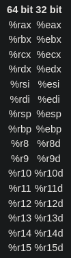
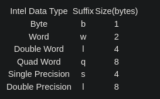
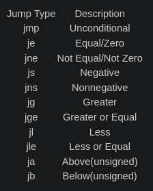

# Intro To x86-64


## Introduction
- Different computers have different processors, and machine code is specific to that parocessor
- Machine code is represented by a readable form of the code called assembly code
- The code is produced by a compiler
- Source code > compiler > assembly code > machine code
- Radare2 is a RE framework that disassembles and debugs binaries
    - `r2 -d <binary>` to open a binary in r2
    - `aa` to analyze the program
    - `e asm.syntax=att` set disassembly syntax to AT&T
    - `?` for general help
    - `<command>?` for help on a command
    - `afl` to see list of functions
    - `pdf @<function>` to view assembly code in function
```
The values on the complete left column are memory addresses of the instructions, and these are usually stored in a structure called the stack(which we will talk about later). The middle column contains the instructions encoded in bytes(what is usually the machine code), and the last column actually contains the human readable instructions. 
```
- Other important r2 commands
    - `db <hex memory address>` set breakpoint
    - `dc` to start execution of program
    - `dr` to view register values
    - `px @<address>` to print out value of variable
    - `ds` to move to the next instruction
        - Use `pdf @<function>` again and we see `;-- rip:` tells us where the next instruction is
- Assembly uses registers to
    - Transfer data between memory and register, and vice versa
    - Perform arithmetic operations on registers and data
    - Transfer control to other parts of the program
- 
    - The architecture is x86-64, so the registers are 64bit, which means that each register can hold 64 bits of data
    - The first 6 registers are general purpose
    - `%rsp` is the stack pointer and points to the top of the stack
    - `%rbp` is a frame pointer and points to the frame of the function currently being executed
        - Every function is executed in a new frame
    - `%rip` points to the current instruction
- Move data between registers
    - `movq source, destination`
    - Transferring constants(which are prefixed using the `$` operator) e.g. `movq $3 rax` would move the constant 3 to the register
    - Transferring values from a register e.g. `movq %rax %rbx` which involves moving value from rax to rbx
    - Transferring values from memory which is shown by putting registers inside brackets e.g. `movq %rax (%rbx)` which means move value stored in %rax to memory location represented by %rbx.
- The last letter of the mov instruction represents the size of the data
    - 
- Other important instructions
    - `leaq source, destination`: this instruction sets destination to the address denoted by the expression in source
    - `addq source, destination`: destination = destination + source
    - `subq source, destination`: destination = destination - source
    - `imulq source, destination`: destination = destination * source
    - `salq source, destination`: destination = destination << source where << is the left bit shifting operator
    - `sarq source, destination`: destination = destination >> source where >> is the right bit shifting operator
    - `xorq source, destination`: destination = destination XOR source
    - `andq source, destination`: destination = destination & source
    - `orq source, destination`: destination = destination | source
- **Important note:** gdb and r2 seem to have different orders of instructions, so `source, destination` in r2 may be `destination, source` in gdb. They also differ in syntax and commands

## If Statements
- General structure
```
if(condition){
  do-stuff-here
}else if(condition) //this is an optional condition {
  do-stuff-here
}else {
  do-stuff-here
}
```
- If statements in assembly use these instructions
    - `cmpq source2, source1`: it is like computing a-b without setting destination
    - `testq source2, source1`: it is like computing a&b without setting destination
- Jump instructions are used to transfer control to different instructions
    - 
- Unsigned integets can't be negative while signed integers can be either positive or negative
    - Two's complement is used for signed integers
    - Normal binary calculations are used for unsigned integers
- Exercise
    - Assembly for if2
```
Dump of assembler code for function main:
   0x00005555554005fa <+0>:     push   rbp
   0x00005555554005fb <+1>:     mov    rbp,rsp
   0x00005555554005fe <+4>:     mov    DWORD PTR [rbp-0xc],0x0
   0x0000555555400605 <+11>:    mov    DWORD PTR [rbp-0x8],0x63
   0x000055555540060c <+18>:    mov    DWORD PTR [rbp-0x4],0x3e8
   0x0000555555400613 <+25>:    mov    eax,DWORD PTR [rbp-0xc]
   0x0000555555400616 <+28>:    cmp    eax,DWORD PTR [rbp-0x8]
   0x0000555555400619 <+31>:    jge    0x555555400629 <main+47>
   0x000055555540061b <+33>:    mov    eax,DWORD PTR [rbp-0x8]
   0x000055555540061e <+36>:    cmp    eax,DWORD PTR [rbp-0x4]
   0x0000555555400621 <+39>:    jge    0x555555400630 <main+54>
   0x0000555555400623 <+41>:    and    DWORD PTR [rbp-0x8],0x64
   0x0000555555400627 <+45>:    jmp    0x555555400630 <main+54>
   0x0000555555400629 <+47>:    add    DWORD PTR [rbp-0xc],0x4b0
=> 0x0000555555400630 <+54>:    sub    DWORD PTR [rbp-0x4],0x3e7
   0x0000555555400637 <+61>:    mov    eax,0x0
   0x000055555540063c <+66>:    pop    rbp
   0x000055555540063d <+67>:    ret    
End of assembler dump.
```
    - I used gdb+gef
    1. 96
    2. 0
    3. 1
    4. &

## Loops
- While loop
```
while(condition){

  Do-stuff-here

  Change value used in condition

}
```
- For loop
```
for(initialise value: condition; change value used in condition){

  do-stuff-here

}
```
- Assembly for loop1
```
Dump of assembler code for function main:
   0x00005555554005fa <+0>:     push   rbp
   0x00005555554005fb <+1>:     mov    rbp,rsp
=> 0x00005555554005fe <+4>:     mov    DWORD PTR [rbp-0xc],0x4
   0x0000555555400605 <+11>:    mov    DWORD PTR [rbp-0x8],0x9
   0x000055555540060c <+18>:    mov    DWORD PTR [rbp-0x4],0xa
   0x0000555555400613 <+25>:    jmp    0x555555400619 <main+31>
   0x0000555555400615 <+27>:    add    DWORD PTR [rbp-0xc],0x2
   0x0000555555400619 <+31>:    cmp    DWORD PTR [rbp-0xc],0x8
   0x000055555540061d <+35>:    jle    0x555555400615 <main+27>
   0x000055555540061f <+37>:    mov    eax,0x0
   0x0000555555400624 <+42>:    pop    rbp
   0x0000555555400625 <+43>:    ret    
End of assembler dump.
```
- Exercise
    - Assembly for loop2
```
Dump of assembler code for function main:
   0x00005555554005fa <+0>:     push   rbp
   0x00005555554005fb <+1>:     mov    rbp,rsp
=> 0x00005555554005fe <+4>:     mov    DWORD PTR [rbp-0xc],0x14
   0x0000555555400605 <+11>:    mov    DWORD PTR [rbp-0x8],0x16
   0x000055555540060c <+18>:    mov    DWORD PTR [rbp-0x4],0x0
   0x0000555555400613 <+25>:    mov    DWORD PTR [rbp-0x4],0x4
   0x000055555540061a <+32>:    jmp    0x55555540062f <main+53>
   0x000055555540061c <+34>:    and    DWORD PTR [rbp-0xc],0x2
   0x0000555555400620 <+38>:    sar    DWORD PTR [rbp-0x8],1
   0x0000555555400623 <+41>:    mov    edx,DWORD PTR [rbp-0x4]
   0x0000555555400626 <+44>:    mov    eax,edx
   0x0000555555400628 <+46>:    add    eax,eax
   0x000055555540062a <+48>:    add    eax,edx
   0x000055555540062c <+50>:    mov    DWORD PTR [rbp-0x4],eax
   0x000055555540062f <+53>:    cmp    DWORD PTR [rbp-0x4],0x63
   0x0000555555400633 <+57>:    jle    0x55555540061c <main+34>
   0x0000555555400635 <+59>:    mov    eax,0x0
   0x000055555540063a <+64>:    pop    rbp
   0x000055555540063b <+65>:    ret    
End of assembler dump.

```
    - I used gdb+gef
    1. 5
    2. 0
    3. 2
    4. 0

## crackme1
- Open up the binary and examine the preset strings
- We see "127", "0", "0", "1", and a "."
- We also see the the program using functions such as `strlen`, `strcmp`, and `strtok`, so we can assume that some string manipulation is happening
- With some knowledge of networking, we can append the given strings to get `127.0.0.1`
- The harder way to solve it is to actually do RE and step through the code until we see what the input password is being compared with

## crackme2
- We see that a path `/home/tryhackme/install-files/secret.txt` is referenced
- Taking a look at the `secret.txt` file, we see that it contains `vs3curepwd`
- Entering this as the answer doesn't work, but if we look at the hint we see that it says `reversing?`
- We also know that a lot of string manipulation is going on, so let's try reversing the characters to see if it works
- The answer is `dwperuc3sv`
