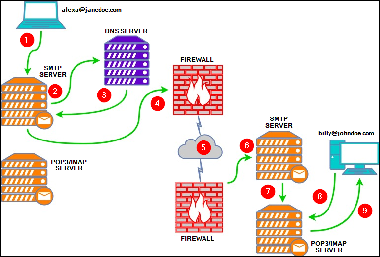

# Phishing Emails 1

## The Email Address
- Ray Tomlinson invented concept of emails when ARPANET was created
- Components
    1. User mailbox or username
    2. @
    3. Domain

## Email Delivery
- Protocols used by email
    - SMPT (Simple Mail Transfer Protocol) - used for sending emails (outgoing)
    - POP3 (Post Office Protocol) - transferring email between client and mail server (incoming)
        - Emails are downloaded and stored on a single device (incoming)
        - Sent messages are stored on the single device from which the email was sent
        - Emails can only be accessed from the single device the emails were downloaded to
        - All messages are deleted from the server once downloaded to the device unless otherwise specified
    - IMAP (Internet Message Access Protocol) - transferring email between client and mail server
        - Emails are stored on the server and can be downloaded to multiple devices
        - Sent messages are stored on the server
        - Messages can be synced and accessed across multiple devices
- Each protocol has its own default port
- 
1. Alexa composes an email to Billy (billy@johndoe.com) in her favorite email client. After she's done, she hits the send button.
2. The SMTP server needs to determine where to send Alexa's email. It queries DNS for information associated with johndoe.com. 
3. The DNS server obtains the information johndoe.com and sends that information to the SMTP server. 
4. The SMTP server sends Alexa's email across the Internet to Billy's mailbox at johndoe.com.
5. In this stage, Alexa's email passes through various SMTP servers and is finally relayed to the destination SMTP server. 
6. Alexa's email finally reached the destination SMTP server.
7. Alexa's email is forwarded and is now sitting in the local POP3/IMAP server waiting for Billy. 
8. Billy logs into his email client, which queries the local POP3/IMAP server for new emails in his mailbox.
9. Alexa's email is copied (IMAP) or downloaded (POP3) to Billy's email client. 

## Email Headers
- 2 parts to email
    - email header
    - email body
- Internet Message Format (IMF) - syntax for email messages
- Look at the raw email details
- Some Headers
    - From
    - Subject
    - Date
    - To
    - X-Originating-IP - The IP address of the email was sent from (this is known as an X-header)
    - Smtp.mailfrom/header.from - The domain the email was sent from (these headers are within Authentication-Results)
    - Reply-To - This is the email address a reply email will be sent to instead of the From email address
- return-path is the same as reply-to
- Once you find the IP address of the sender, use [ARIN](http://www.arin.net/) to find more information

## Email Body
- Part of the email which contains text (plain or html) the sender wants yuo to view
- Email client will allow you to see the raw code/text and attachments
- Make sure not to accidentally double-click an email's attachment
- When looking at the raw code/text, the attachment may be encoded in base64. In this case, simple decode it, save the decoded text as a file, and open the file with software that's meant for it. For example, if you know the file is a pdf, then save the decoded data as a pdf file and open it with a pdf reader

## Types of Phishing
- Spam - unsolicited junk emails sent out in bulk to a large number of recipients. The more malicious variant of Spam is known as MalSpam.
- Phishing -  emails sent to a target(s) purporting to be from a trusted entity to lure individuals into providing sensitive information. 
- Spear phishing - takes phishing a step further by targeting a specific individual(s) or organization seeking sensitive information.  
- Whaling - is similar to spear phishing, but it's targeted specifically to C-Level high-position individuals (CEO, CFO, etc.), and the objective is the same. 
- Smishing - takes phishing to mobile devices by targeting mobile users with specially crafted text messages. 
- Vishing - is similar to smishing, but instead of using text messages for the social engineering attack, the attacks are based on voice calls. 
- Common characteristics
    - The sender email name/address will masquerade as a trusted entity (email spoofing)
    - The email subject line and/or body (text) is written with a sense of urgency or uses certain keywords such as Invoice, Suspended, etc. 
    - The email body (HTML) is designed to match a trusting entity (such as Amazon)
    - The email body (HTML) is poorly formatted or written (contrary from the previous point)
    - The email body uses generic content, such as Dear Sir/Madam. 
    - Hyperlinks (oftentimes uses URL shortening services to hide its true origin)
    - A malicious attachment posing as a legitimate document
- Defanging URLs - prevent user from accidentally clicking malicious link
    - “http” is replaced with “hxxp”
    - “ftp” is replaced with “fxp”
    - Brackets are added to domain names; for example, www.example.com is replaced with www[.]example[.]com
    - Brackets are added to the IP address; for example, 8.8.8.8 is replaced with 8[.]8[.]8[.]8

## Conclusion
- BEC (Business Email Compromise) - when an adversary gains control of an internal employee's account and then uses the compromised email account to convince other internal employees to perform unauthorized actions
