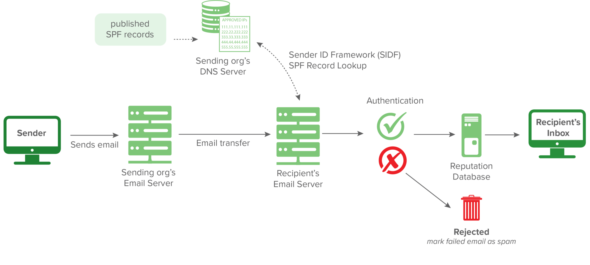

# Phishing Emails 4

## Introduction
- Ways to protect users from phishing
    - Email Security (SPF, DKIM, DMARC)
    - SPAM Filters (flags or blocks incoming emails based on reputation)
    - Email Labels (alert users that an incoming email is from an outside source)
    - Email Address/Domain/URL Blocking (based on reputation or explicit denylist)
    - Attachment Blocking (based on the extension of the attachment)
    - Attachment Sandboxing (detonating email attachments in a sandbox environment to detect malicious activity)
    - Security Awareness Training (internal phishing campaigns)
- Phishing is classified as **Technique ID 1598 (T1598)** and contains three sub-techniques

## SPF (Sender Policy Framework)
- Used to authenticate the sender of an email
- SPF record - a DNS TXT record containing a list of the IP addresses that are allowed to send email on behalf of your domain
- 
- Ex. `v=spf1 ip4:127.0.0.1 include:_spf.google.com -all`
    - v=spf1 -> This is the start of the SPF record
    - ip4:127.0.0.1 -> This specifies which IP (in this case version IP4 & not IP6) can send mail
    - `include:_spf.google.com` -> This specifies which domain can send mail
    - -all -> non-authorized emails will be rejected
- [SPF Record check](https://dmarcian.com/spf-survey/)
- [Resource 1](https://dmarcian.com/spf-syntax-table/), [Resource 2](https://dmarcian.com/what-is-the-difference-between-spf-all-and-all/)

## DKIM (DomainKeys Identified Mail)
- DKIM (DomainKeys Identified Mail) authenticates an email that's being sent
- DKIM records exist in DNS, but is more complicated that SPF and can survive forwarding, which makes it superior to SPF
- Ex. `v=DKIM1; k=rsa; p=MIIBIjANBgkqhkiG9w0BAQEFAAOCAQ8AMIIBCgKCAQEAxTQIC7vZAHHZ7WVv/5x/qH1RAgMQI+y6Xtsn73rWOgeBQjHKbmIEIlgrebyWWFCXjmzIP0NYJrGehenmPWK5bF/TRDstbM8uVQCUWpoRAHzuhIxPSYW6k/w2+HdCECF2gnGmmw1cT6nHjfCyKGsM0On0HDvxP8I5YQIIlzNigP32n1hVnQP+UuInj0wLIdOBIWkHdnFewzGK2+qjF2wmEjx+vqHDnxdUTay5DfTGaqgA9AKjgXNjLEbKlEWvy0tj7UzQRHd24a5+2x/R4Pc7PF/y6OxAwYBZnEPO0sJwio4uqL9CYZcvaHGCLOIMwQmNTPMKGC9nt3PSjujfHUBX3wIDAQAB`
    - v=DKIM1-> This is the version of the DKIM record. This is optional. 
    - k=rsa -> This is the key type. The default value is RSA. RSA is an encryption algorithm (cryptosystem).
    - p= -> This is the public key that will be matched to the private key, which was created during the DKIM setup process. 
- [Resource 1](https://dmarcian.com/dkim-selectors/), [Resource 2](https://help.returnpath.com/hc/en-us/articles/222481088-DKIM-DNS-record-overview)
- The `Authentication-Results` header shows whether DKIM passed or failed

## DMARC (Domain-based Message Authentication Reporting and Conformance)
- Ties the result of SPF and DKIM together to the content of an email
- Ex. `v=DMARC1; p=quarantine; rua=mailto:postmaster@website.com`
    - v=DMARC1 -> Must be in all caps, and it's not optional
    - p=quarantine -> If a check fails, then an email will be sent to the spam folder (DMARC Policy)
    - rua=mailto:postmaster@website.com -> Aggregate reports will be sent to this email address
- [Resource](https://dmarcian.com/dmarc-record/)
- [Resource](https://dmarc.org/overview/)
- [Resource](https://dmarcian.com/alignment/)

## S/MIME (Secure/Multipurpose Internet Mail Extensions)
- 2 main parts of S/MIME are
    1. Digital signatures
    2. Encryption
- Process
    - If Bob wishes to use S/MIME, then he'll need a digital certificate. This digital certificate will contain his public key. 
    - With this digital certificate, Bob can "sign" the email message with his private key. 
    - Mary can then decrypt Bob's message with Bob's public key. 
    - Mary will do the same (send her certificate to Bob) when she replies to his email, and Bob complete the same process on his end.
    - Both will now have each other's certificates for future correspondence. 
- [Resource](https://docs.microsoft.com/en-us/exchange/security-and-compliance/smime-exo/smime-exo)
- Nonrepudiation - The uniqueness of a signature prevents the owner of the signature from disowning the signature

## SMPT Status Codes
- [Resource](https://www.wireshark.org/docs/dfref/s/smtp.html)
- [Resource](https://www.mailersend.com/blog/smtp-codes)
- Use `smtp.response.code` to filter using status codes
- Use filter `smtp.response.code == 220` and find status code `<domain> Service ready`
- Use `smtp.response.code` and search for an email blocked by smaphaus.org, the answer is `156,553`. Error is `mailbox name not allowed`

## SMPT Traffic Analysis
- [Resource](https://www.wireshark.org/docs/dfref/i/imf.html)

## SMPT and C&C Communication
- C&C (Command and Control)
- [Resource](https://attack.mitre.org/techniques/T1071/003/)

## Conclusion
- [Resource](https://www.incidentresponse.com/playbooks/phishing)
