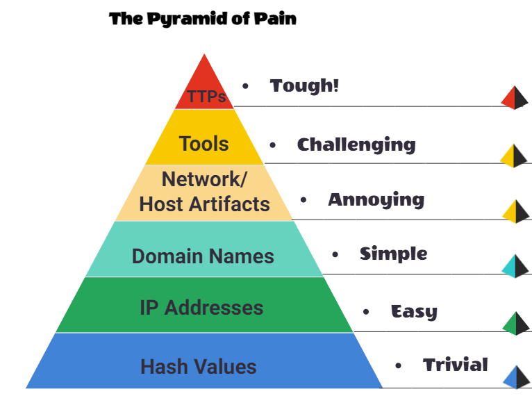

# Pyramid of Pain

## Hash Values (Trivial)
- Hash - numeric value of a fixed length that uniquely identifies data
- Most popular are MD5, SHA-1, SHA-2
- No two files can have the same hash
- You can do hash lookups on websites like `Virustotal` or `Metadefender Cloud - OPSWAT`

## IP Address (Easy)
- Knowing the malicious actor's IP is valuable
- Find the ip addresses that a binary is try to contact with `app.any.run`
- These IP addresses can be blocked, denied, or dropped by the firewall, but the actor can use Fast Flux to circumvent this

## Domain Names (Simple)
- Domain names require registration and the modification of DNS records
- May be hard to analyze because many DNS providers have loose standards and provide APIs to make it easier for the attacker to change the domain
- [Punycode](https://www.jamf.com/blog/punycode-attacks/) attacks redirect users to a malicious domain that seems legitimate at first glance
- Attackers can hide malicious domains with URL shortners
	- Ex.
		- bit.ly
		- goo.gl
		- ow.ly
		- s.id
		- smarturl.it
		- tiny.pl
		- tinyurl.com
		- x.co
	- You can see the actual website the link is redirecting to by appending `+` to the end of the URL	
- Exercise
	1. `craftingalegacy.com`
	2. domain name
	3. punycode attack
	4. https://tryhackme.com/

## Host Artifacts (Annoying)
- Host artifacts - traces that attackers leave on the system
	- Registry values
	- Suspicious process execution
	- Attack patterns
	- IOCs (Indicators of Compromise)
- Exercise
	- Resources (Found these by googling the malicious file `G_jugk.exe`)
		- https://any.run/report/e2d2ebafc33d7c7819f414031215c3669bccdfb255af3cbe0177b2c601b0e0cd/90b76d7b-8df6-43c5-90ec-d4bbcfb4fa19
		- https://app.any.run/tasks/90b76d7b-8df6-43c5-90ec-d4bbcfb4fa19/
	1. 35.214.215.33
	2. Emotet
	3. G_jugk.exe
	4. CMO-100120 CDW-102220.doc

## Network Artifacts (Annoying)
- Network artifacts - user-agent string, C2 information, or URI patterns followed by HTTP POST requests
- Can be detected using Wireshark or an IDS like Snort
- Exercise
	- Resources (google `trident user agent`)
	1. Google `trident user agent` to find `Internet Explorer`
	2. 6

## Tools (Challenging)
- Malware samples
	- [Malware Bazaar](https://bazaar.abuse.ch/)
	- [Malshare](https://malshare.com/)
	- [SOC Prime Threat Detection Marketplace](https://tdm.socprime.com/)
- Fuzzy hashing - helps perform a similarity analysis, match two files with minor differences based on the fuzzy hash values
- Exercise
	1. Fuzzy hashing
	2. Context triggered piecewise hashes

## TTPs (Tough)
- TTPs - Tactics, techniques, and procesured
	- Contains the entire [MITRE ATT&CK Matrix](https://attack.mitre.org/)
- Exercise
	1. 9
	2. Search the Attack Matrix to find this page `https://attack.mitre.org/techniques/T1041/`, which shows that Chimera used Cobalt Strike

## Conclusion
- Research APT groups
- [APT Groups](https://www.fireeye.com/current-threats/apt-groups.html)
